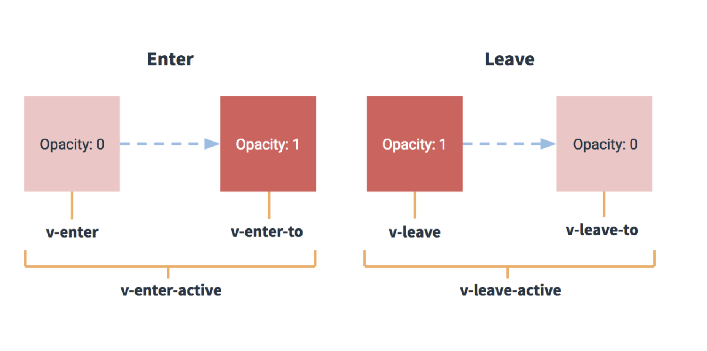

# 漸變與動畫

針對組件或 DOM 節點在新增、移除或更新的時候進行過場漸變的效果與動畫。

## 漸變

Vue 將過場漸變的效果包裝成一個獨立的 `<transition>` 組件，
再由開發者自行定義元素的進場 (Enter) 、退場 (Leave) 以及動畫過程漸變 (Transitions) 的樣式。



### 進場和退場

- 元素進場
  - `v-enter`：定義元素在進場「之前」的樣式
  - `v-enter-active`：定義元素在進場「過程」的樣式
  - `v-enter-to`：定義元素在進場「結束時」的樣式
- 元素退場
  - `v-leave`：定義元素在退場「之前」的樣式
  - `v-leave-active`：定義元素在退場「過程」的樣式
  - `v-leave-to`：定義元素在退場「結束時」的樣式

### 使用方式

只需要將要執行過場動畫的元素/組件，透過 `<transition>` 包覆起來即可：

```html{1,5}
<transition>
  <div class="card" v-show="show">
    <h3 class="card-tile">Card</h3>
  </div>
</transition>
```

接著在 CSS 定義它的過場漸變的樣式，因為是 **預設樣式設定**，統一使用 `v-` 作為前綴開頭：

```scss
.v-enter-active,
.v-leave-active {
  transition: opacity 1s;
}
.v-enter,
.v-leave-to {
  opacity: 0;
}
```

<TryBox>
  <component-transition-TransitionOpacity />
</TryBox>

除了 `v-if` 、 `v-show` 之外，像是 `<component :is>` 以及組件的根節點（Component Root Nodes）也都可以套用 `<transition>` 來處理漸變動畫，不過對應的 CSS 的樣式還是得自行撰寫。

### 替 `<transition>` 取名稱

只需在 `<transition>` 加上 `name` 屬性即可：

```html{1,7}
<transition name="slide">
  <div class="card" v-show="show">
    <h3 class="card-tile">Card</h3>
  </div>
</transition>

<transition name="fade">
  <div class="card" v-show="show">
    <h3 class="card-tile">Card</h3>
  </div>
</transition>
```

對應的 CSS 就將 `v-` 前綴改寫成我們自己定義的名稱：

```scss
.slide-enter-active,
.slide-leave-active {
  transition: all 1s ease;
}
.slide-enter {
  transform: translateX(-100%);
}
.slide-leave-to {
  transform: translateX(100%);
}
```

<TryBox>
  <component-transition-NamedTransition />
</TryBox>

## 條件與動態切換

如果是使用 **同一元素**，並搭配 `v-if` 和 `<transition>` 渲染上會無效果：

```html{2,5}
<transition name="fade">
  <div class="card" v-if="show">
    <h3 class="card-tile">Card 1</h3>
  </div>
  <div class="card" v-else>
    <h3 class="card-tile">Card 2</h3>
  </div>
</transition>
```

<TryBox>
  <component-transition-TransitionNoKey />
</TryBox>

Vue 為了提高網頁渲染的效率，會選擇 **重複利用已經存在的元素而不是重新渲染**。
由於 Card 1 與 Card 2 都是 `<div>` 的元素，所以即便我們在 `v-if` 外面加上 `<transition>` 標籤，但由於 Card 2 也是使用 **同一個元素** 的緣故，使得一開始的這個 `<div>` 並未因此消失。

解決方式為在 `v-if` 與 `v-else` 的元素上，加上 **唯一識別** 的 `key` 屬性來告訴 Vue 這個元素需要重新渲染：

```html{2,5}
<transition name="fade">
  <div class="card" v-if="show" key="card1">
    <h3 class="card-tile">Card 1</h3>
  </div>
  <div class="card" v-else key="card2">
    <h3 class="card-tile">Card 2</h3>
  </div>
</transition>
```

<TryBox>
  <component-transition-TransitionWithKey />
</TryBox>

如果是組件之間的切換則不需要 `key` 屬性，可以直接使用 `<component>` 搭配 `is` 屬性來做動態切換：

```html{2}
<transition name="fade">
  <component :is="current"></component>
</transition>
```

### 漸變效果的順序

Vue 針對漸變效果的切換，除了預設的新元素進場的動畫先執行，再移除現有的元素 (in-out) 以外，同時也提供了先移除現有的元素，再執行新元素進場的動畫 (out-in)。

```html{1}
<transition name="fade" mode="in-out">
  <div class="card" v-if="show" key="card1">
    <h3 class="card-tile">Card 1</h3>
  </div>
  <div class="card" v-else key="card2">
    <h3 class="card-tile">Card 2</h3>
  </div>
</transition>
```

只需要在 `<transition>` 加入 `mode` 屬性與指定的順序即可：

<TryBox>
  <component-transition-TransitionMode />
</TryBox>

## 複數組件的漸變渲染

`<transition>` 只適合在「單一節點」的情況下使用，若是有多個節點則需改用 `<transition-group>` 來替代。

### `<transition-group>`

相比於 `<transition>` ， `<transition-group>` 有幾個不一樣的地方，
首先是 `<transition-group>` 會渲染真實的元素，而且預設會在最外層用 `<span>` 元素來包覆。 如果需要修改包覆的元素，則需要在 `<transition-group>` 加上 `tag` 屬性來指定。

再來是每個元素必須設定唯一 `key` 屬性，理由與 `v-if` 時相同。

```html{2,4,7}
<!-- 替代使用 div 來包覆 -->
<transition-group name="fade" tag="div">
  <!-- 需加入唯一的 key 屬性作為識別 -->
  <div class="card" v-show="show" key="card1">
    <h3 class="card-tile">Card 1</h3>
  </div>
  <div class="card" v-show="!show" key="card2">
    <h3 class="card-tile">Card 2</h3>
  </div>
</transition-group>
```

除了 `v-show` 之外， `<transition-group>` 最常被拿來與 `v-for` 來做搭配，尤其是列表的顯示：

```html
<transition-group class="row" name="slide" tag="ul">
  <li class="col-2" v-for="(item,index) in list" :key="index + '_' + item">
    <div class="card">{{ item }}</div>
  </li>
</transition-group>
```

<TryBox>
  <component-transition-TransitionGroupWithFor />
</TryBox>
