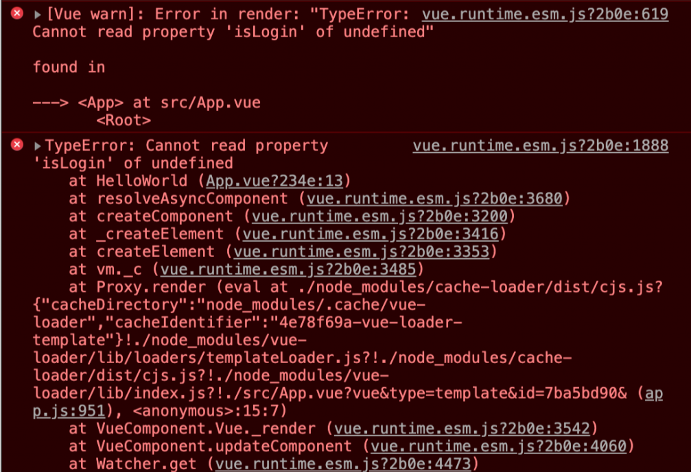
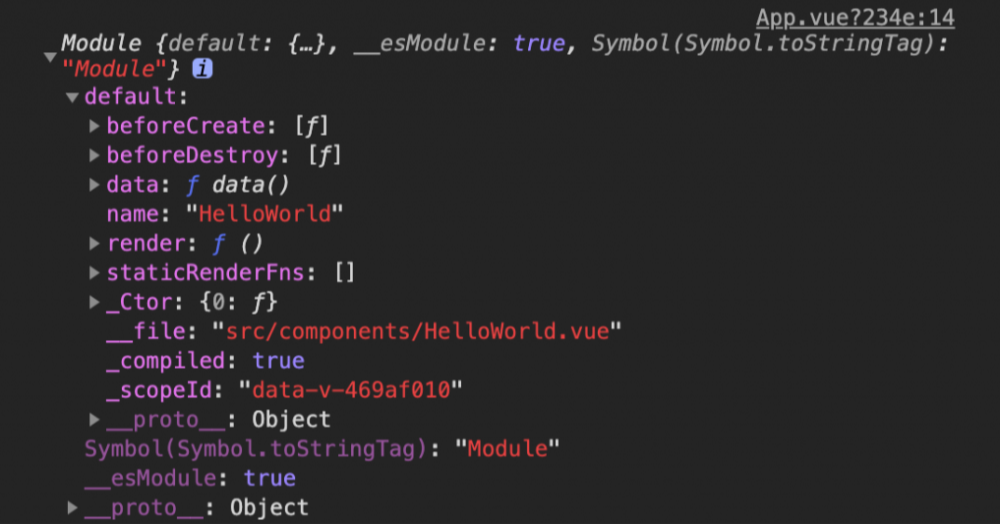

# import 和 require 的運用

## require

主要目的就是為了將檔案讀取進來。而在 Vue 裡面，他不僅僅是可以引入 JavaScript 檔案，連同圖片檔案也可以利用這種方式來載入。只是圖片檔案利用 `require` 載入後，會變成以 `base64` 的方式存在於組件中。

如果是使用 `require` 的話，最後面必須要加上 `.default` 才能讓組件可以使用。

使用環境變數，來載入組件的時候，那麼使用 `require` 是個不錯的選擇：

```js{4}
let component;

if (window.env.component !== '') {
  component = require(`@/component/${window.env.component}.vue`);
}
```

而 `import` 沒辦法使用 \`\${...}\`，這種方式引入檔案。

### 使用時機

當需要依照某些邏輯條件，來載入不同的組件的時候，我們就能利用 `require` 的方法來達成。而除了放在組件外面，也可以放在 `components` 屬性裡面來載入，但記得要給他一個名字。

```js
export default {
  components: {
    HelloWorld: require('@/components/HelloWorld.vue').default,
  },
};
```

## import

`import` 放在一般的 JavaScript 中，編譯過程中就會報錯。

```js{3}
if (window.env) {
  // 會有錯誤
  import HelloWorld from '@/components/HelloWorld.vue';
}
```

當在 `components` 屬性中使用的時候，`import` 可以應用懶加載的方式來達成載入。也就是說 `components` 裡面可以利用 **函式** 的方式來載入組件。

```js{4}
export default {
  name: 'App',
  components: {
    HelloWorld: () => import('@/components/HelloWorld.vue'),
  },
};
```

這一點是 `require` 所無法辦到的。於是可以做一些變化：

```js{4,5,6,7}
export default {
  name: 'App',
  components: {
    HelloWorld: () => {
      if(...) return import('@/components/HelloWorld.vue')
      else return import('@/components/HelloKitty.vue')
    }
  },
};
```

這樣的方式就很類似我們在 `<script>` 標籤開始的地方，使用邏輯判斷搭配 `require` 來載入組件。

不過，基本上 `import` 依舊無法使用 \`\${...}\` 標籤樣板。

### lazy load 的 this 問題

如果在 `components` 屬性中，使用懶加載和利用 `this` 時：

```js{4}
export default {
  components: {
    User: () => {
      if (this.isLogin) {
        return import('@/components/User.vue');
      } else {
        return import('@/components/Geusts.vue');
      }
    },
  },
  data() {
    return {
      isLogin: false,
    };
  },
};
```

會出現 `Cannot read property 'isLogin' of undefined` 的錯誤。



實際上這個 `this` 為 `undefined`。

然而，可以透過將變數放於全域空間來解決，但得確保這個組件，這個變數，僅只有**單一目的**、**單一功能**，否則放在外面的變數，會因為封裝問題，造成 **組件重用時的污染**。

```js{1}
let userIsLogin = false;

export default {
  name: 'App',
  components: {
    User: () => {
      if (userIsLogin) {
        return import('@/components/User.vue');
      } else {
        return import('@/components/Geusts.vue');
      }
    },
  },
  data() {
    return {
      isLogin: userIsLogin,
    };
  },
};
```

### 支援 Promise

`import` 本身其實是可以支援 `Promise` 的操作的，也就是說，這兩種寫法是可以被接受的：

```js
import('./a.js').then(...)

// 或是

const a = await import('./a.js')
```

同時也可以在 `components` 屬性中，使用 `then` 來取得載入的檔案，但記得要將東西 `return` 回去，不然組件會報錯。

```js{3,4,5,6}
export default {
  components: {
    User: () => {
      return import('@/components/User.vue').then((module) => {
        return module;
      });
    },
  },
};
```

如果再將 `module` console 出來，會發現他其實是子組件 Vue 的實例。



## 參考連結

[Component 魔術方法 Day 4](https://ithelp.ithome.com.tw/articles/10213923)
