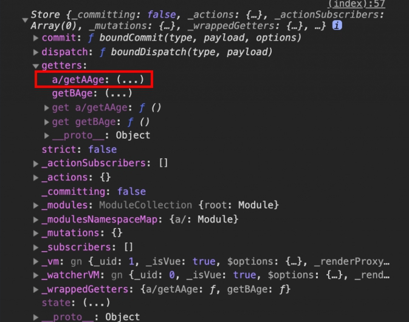

# Module

## 分割

將 `store` 分割成 `module`，每個 `module` 擁有自己的 `state`、`mutation`、`action`、`getter`。

```javascript
const moduleA = {
  namespaced: true,
  state: { ... },
  mutations: { ... },
  actions: { ... },
  getters: { ... }
}

const moduleB = {
  state: { ... },
  mutations: { ... },
  actions: { ... }
}

const store = new Vuex.Store({
  modules: {
    moduleA,
    moduleB
  }
})

store.state.moduleA // -> moduleA 的state狀態
store.state.moduleB // -> moduleB 的state狀態
```

## 作用域

`module` 內部的 `mutation` 和 `getter`，接收的第一個參數為 **`Module` 作用域物件**。

```js
const moduleA = {
  namespaced: true,
  // count 會寫到全域
  // 取用方法: $store.state.moduleA.count
  state: { count: 0 },
  mutations: {
    increment(state) {
      // state: Module 作用域物件
      state.count++;
    },
  },

  getters: {
    // 取用方法: $store.getters.moduleA.doubleCount
    // 或: $store.rootGetters.doubleCount
    doubleCount(state) {
      return state.count * 2;
    },
  },
};
```

`action` 同樣也是使用 `Module` 作用域物件。

```javascript
const moduleA = {
  // ...
  actions: {
    // state: 作用域狀態
    // rootState: 根節點、子節點的 state 資料
    // rootGetters: 根節點、子節點的 getters 資料
    actionIncrement({ state, dispatch, commit, rootState, rootGetters }) {
      if ((state.count + rootState.count) % 2 === 1) {
        commit('increment');
      }
    },
  },
};
```

## 命名空間

默認情況下，模組內部的 `action`、`mutation` 和 `getter` 是註冊在 **全域** 的命名空間。

這樣使得多個模組能夠對同一 `mutation` 或 `action` 作出響應。

通過添加 `namespaced: true` 的方式使其成為帶命名空間的模組。

當模組被註冊後，它的所有 `getter`、`action` 及 `mutation` 都會自動根據 **模組註冊的路徑** 調整命名。



### 範例

```js{4,31}
const store = new Vuex.Store({
  modules: {
    account: {
      namespaced: true,

      // 模組內容（module assets）
      // 模組內的狀態已經是嵌套的了，使用 namespaced 屬性不會對其產生影響
      state: { ... },
      getters: {
        isAdmin () { ... } // -> getters['account/isAdmin']
      },
      actions: {
        login () { ... } // -> dispatch('account/login')
      },
      mutations: {
        login () { ... } // -> commit('account/login')
      },

      // 嵌套模組
      modules: {
        // 繼承父模組的命名空間
        myPage: {
          state: { ... },
          getters: {
            profile () { ... } // -> getters['account/profile']
          }
        },

        // 進一步嵌套命名空間
        posts: {
          namespaced: true,
          state: { ... },
          getters: {
            popular () { ... } // -> getters['account/posts/popular']
          }
        }
      }
    }
  }
})
```

在 `mapActions`，`mapMutations` 與 `mapGetters` 中皆需也使用模組的註冊名稱作為呼叫的路徑。

```js{6,7,8,9}
import { mapGetters } from 'vuex';

export default {
  name: 'MyComponent',
  computed: {
    ...mapGetters({
      getAAge: 'a/getAAge',
      getBAge: 'getBAge',
    }),
  },
};
```

## 命名空間的綁定函數

使用 `mapState`、`mapGetters`、`mapActions` 和 `mapMutations`。

可以通過使用 `createNamespacedHelpers` 創建基於某個命名空間輔助函數。

> 可用於找 **自身和其他模組** 的 `state`

```js{2,4}
// 注意這一段
import { createNamespacedHelpers } from 'vuex';

const { mapState, mapActions } = createNamespacedHelpers('some/nested/module');

export default {
  computed: {
    // 在 `some/nested/module` 中查找
    ...mapState({
      a: (state) => state.a,
      b: (state) => state.b,
    }),
    ...mapGetters({
      getAAge: 'getAge',
    }),
  },
  methods: {
    // 在 `some/nested/module` 中查找
    ...mapActions(['foo', 'bar']),
  },
};
```

## 第三個參數

在 `namespaced: true` 下，`commit` 和 `dispatch` 的第三個參數可以指定 `{ root: true }`，表示從 **Vuex 根元件** 呼叫一個方法，他可以根據 Module 的設定來 **戳** 到指定的目標。

```js
store.commit('a/other/module', {}, { root: true });
store.dispatch('a/other/module', {}, { root: true });
```

使用情境：在本身的 Module 中，需要去呼叫其他 Module 的時候，必須要加上這個參數，這樣才能觸發到想要的目標。不然依照 `namespaced: true` 的設定，在 Module 裡面的 `commit` 都是觸發本地端 (Local state) 的方法 (包括 `commit` 或是 `dispatch`)。

所以，Module 是 `namespaced: true` 的話，第三個參數沒有設定，就會被回報錯誤。

## 參考

[Vuex 基本入門](https://ithelp.ithome.com.tw/articles/10214429)
